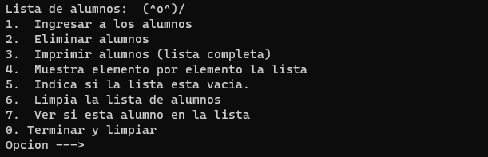

<p align="right">

</p>

# Estructura de Datos en C.

Curso para aspirantes del Programa de Tecnología en Cómputo, generación 43.


### 👥 TEMARIO
    
- Repaso relámpago de C.⚡️
    - Tipos primitivos.
    - Paso de valores por Referencia y por valor.

- TDA (Estructura de datos compuestos).
    - Apuntadores.
    - Estructuras.
    - Memoria dinámica.
        - CALLOC, REALLOC y MALLOC.
        - FREE
    - Nodos.
    - Tipos de estructuras de datos.
- Pila.
    - Concepto.
    - Operaciones.
        - PUSH
        - POP
- Queue (cola).
    - Concepto de FIFO.
    - Operaciones.
        - Enqueue
        - Dequeue
    - Cola Doble.
    - Cola Circular.
- Listas.
    - Simple.
    - Doble.
    - Dinámicas (Si da tiempo).

Si da tiempo.
- Estructuras no lineales.
    - Árboles y grafos.


### **Evaluación**. 📋

|**Criterio**|**Porcentaje**|
|:--------:|:------------:|
|Examen|30%|
|Proyecto|60%|
|Tarea|10%|
|Reporte-Investigación|15%|

### **EXAMEN DIAGNÓSTICO**.
    Fecha limite: 2022-Octubre-8

**Diagnóstico**: [Aquí](https://forms.gle/JjiJiW7EGn3TtAgX6).


### **EXAMEN DE EVALUACIÓN**.
    Fecha limite: 2022-Noviembre-05

**El de evaluación**: [Aquí](https://forms.gle/mjw6JFft1DN889nN7).

**AVISO**: El *copy and paste* a lo rudo no se permite, es decir, no nada más copien y peguen lo primero que encuentrén en internet. Si es que veo que así, no tendrán derecho a calificación en este curso. Es decir, no estoy encontra que las busquen, pero por lo menos cambien al menos las palabras por algo que entiendan. Si tienen dudas con las preguntas en cómo están redactadas, pregunten.

Por último, las respuestas idénticas entre sus compañeros, se les anulará directamente el examen a los dos. Sean más intelegentes en ello, al menos en lugar de ``` int apuntador*``` cambien a ``` int pointer*``` .

> Total 10(+1.5)

**Sit vis vobiscum**🥠 (Es latín, no van a invocar nada aterrador, tranquilos.)

### Formato de entrega.

En el **PROYECTO** como tendrán que hacer *folk* de este repositorio, habrá una carpeta donde dice **PROYECTOS/PROYECTOS_EDA** en esa carpeta estará las instrucción del proyecto y ahí podrán su carpeta de su equipo con su respectivo proyecto de esta manera:

    Carpeta/EQUIPO[INICIALES(Apellido paterno) DE COMPAÑEROS]

Ejemplo:

    Proyectos_eda/Goku777[ACG]

Al menos en todos en su equipo tienen que tener un *commit* auque sea que diga le cambié el nombre a archivo o borré todo el proyecto 🤡 (Suele pasar...) y uno tiene que hacer el *Pull request* al menos xd.

Las **TAREAS** estará igualmente una carpeta llamada **tareas/tareas_eda** ahí colocarán sus tareas creando su carpeta con el nombre empezando por Apellido Paterno luego nombre. 

    Carpeta/ApellidoPaterno_nombre1

Ejemplo:

    tareas_eda/Hiriyaga-john

Si la tarea la deciden hacer con su equipo incluyan el formato que se usó para los proyectos. 

Los **REPORTES** son **individuales** y seguirán el formato que platicó en las tareas.

## Califcaciones.

|#PB|Nombre|Tareas|Proyecto|Examen|Reporte|
|:--:|:-----------------:|:----:|:------:|:-----:|:---:|
|1|Alan Salvador Chilpa Navarro|                    
|2|Fabián Josafat Días Silleros|
|3|Gerardo Daniel Gacia Cerda|
|4|Ian Yael Leon Gallardo|
|5|Ulices Castro Rodriguez|
|6|Emilio Cristóbal Jiménez Treviño|
|7|Brayan Tellez Cruz|
|8|Pedro Eduardo Olivera Parias|
## Proyecto Final.

Realizar una lista doblemente ligada que tenga como objetivo almacenar el tipo de dato *Alumno*, el cuál cuenta con los siguientes campos: **Nombre**, **Número de cuenta** y **edad**. Además de las formas vistas para eliminar un nodo, se debe implementar una extra que consiste en el que el usuario escoja el nodo a eliminar. Para ello, el programa deber ir mostrando cada nodo con las opciones de "ver nodo siguiente" y "ver nodo anterior", presentando la información de cada nodo. Cuando el usuario encuentre el nodo que quiere eliminar debe tener la opción de "Eliminar este nodo" y salir al menú principal.


### Evaluación.
|Elementos                            |%         |
|:-----------------------------------:|:--------:|
|Código comentado e  identado.        |10        |
|Uso de archivos de cabecera.         |30        |
|Implementación de una función Menú.  |10        |
|Correcto funcionamiento del programa.|50        |

Esto sería un ejemplo del menú y lo que se tiene que hacer.

    Fecha limite: 2022-Noviembre-12



## Reporte. 📗
1. Investigar las aplicaciones de las estructuras de datos en la vida real y da por lo menos 5 ejemplos.

El reporte tiene que estar escrito en *markdown*.

    Fecha limite: 2022-Noviembre-12


## Tarea. 📕
1. Investigar cómo se hace un **Queue** y sus operaciones correspondientes  en C++. Hacer un ejemplo completo.
2. Crear una lista ligada simple de **nombres** en C++.


> Máximo para las entregas junto con el proyecto.

    Fecha limite de entregas: 2022-Noviembre-12


